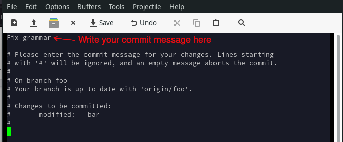
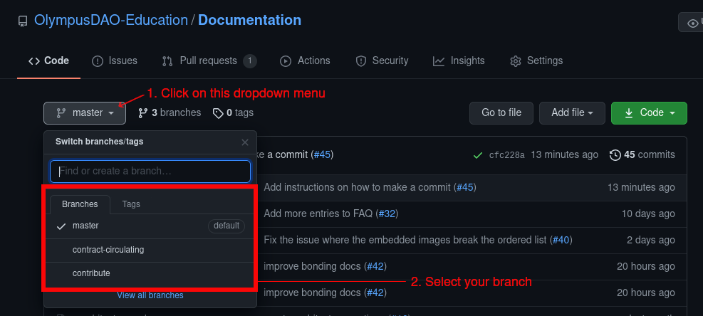
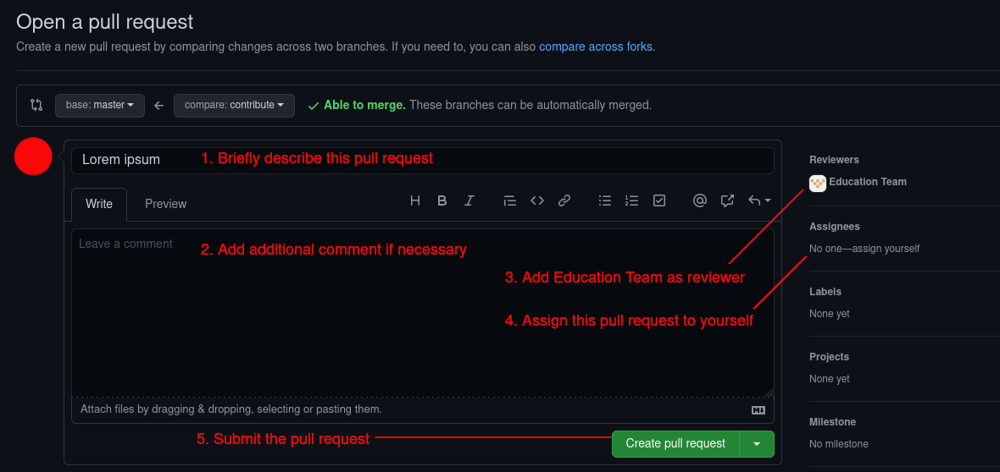
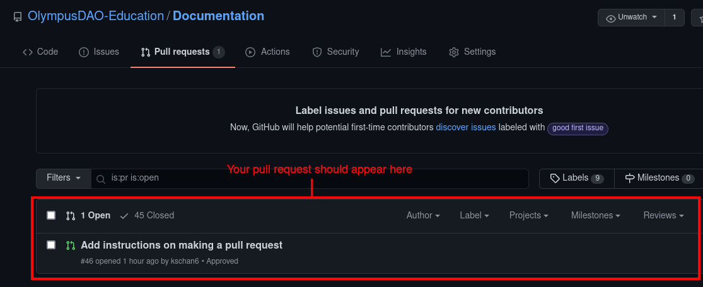
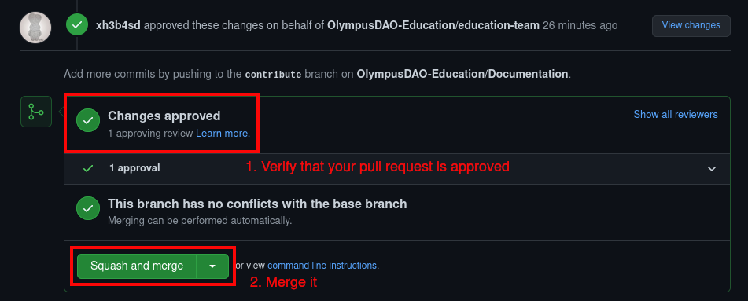

# Kontribusi

OlympusDAO beroperasi secara mandiri, jadi semua orang dapat berkontribusi pada panduan GitBook ini. Halaman ini menguraikan alur kerja kontribusi.

## Bergabunglah Dengan Komunitas Kami

Bergabunglah dengan[ Discord DAO kami](https://discord.gg/42xFV68uEf) dan pastikan Anda mengisi formulir orientasi di sana. Tandai minat Anda dalam pembuatan konten dan Anda akan diberi peran yang sesuai. Setelah itu, Anda dapat berkolaborasi dengan anggota lain di tim Konten untuk lebih menyempurnakan dokumen ini.

_Catatan: Proses orientasi mungkin dapat berubah di masa mendatang. Jangan khawatir, tanyakan saja di discord dan komunitas kami akan memandu Anda melalui proses orientasi._

## Alur Kerja Kontributor

Prasyarat: Jadilah bagian dari tim pendidikan di[ organisasi kami](https://github.com/OlympusDAO-Education) . Tidak yakin bagaimana? Bergabunglah dengan komunitas kami di[ DAO Discord](https://discord.gg/42xFV68uEf) dan cari tahu lebih lanjut.

Setiap kontributor harus mengikuti alur kerja ini saat memperbarui dokumentasi. Pada level tinggi, alur kerjanya adalah sebagai berikut:

1. Klon \(clone\) repositori GitHub ke mesin lokal Anda.
2. Buat cabang \(branch\) pengembangan lokal.
3. Dorong \(push\) cabang Anda ke repositori.
4. Lakukan pekerjaan Anda di cabang lokal.
5. Komit \(commit\) perubahan Anda dan pindahkan ke cabang secara teratur seiring kemajuan pekerjaan Anda.
6. Saat pengembangan selesai, kirimkan permintaan tarik \(pull\) di Github.

Jika Anda tidak terbiasa dengan GitHub, lihat[ panduan ini dari GitHub](https://guides.github.com/activities/hello-world/) .

### Pengaturan Pertama Kali

1. Klon [OlympusDAO-Education/Documentation](https://github.com/OlympusDAO-Education/Documentation) repositori GitHub.

   `git clone git@github.com:OlympusDAO-Education/Documentation.git`

2. Buka direktori proyek tempat Anda mengkloning repositori dan jalankan perintah ini:

   `git status`

3. Anda akan melihat output berikut di terminal Anda:

   > On branch master
   >
   > Your branch is up to date with 'origin/master'.
   >
   > nothing to commit, working tree clean

4. Anda telah berhasil mengkloning repositori GitHub dan bisa memulai perubahan secara lokal.

### Membuat Cabang

Setelah Anda mengkloning repositori, Anda dapat mulai membuat perubahan pada dokumentasi. Semua perubahan harus dilakukan di cabang terpisah sebelum dapat digabungkan ke cabang master \(yaitu menjadi resmi\).

1. Pergi ke cabang `master` dan sinkronisasikan dengan repositori. 

   ```text
    git checkout master
    git pull
   ```

2. Buat cabang untuk melakukan perubahan. Kami namakan`foo` sebagai contoh.

   ```text
    git checkout -b foo
   ```

3. Push cabang Anda ke repositori sehingga anggota lain dapat berkolaborasi dengan Anda di cabang yang sama.

   ```text
    git push -u origin HEAD
   ```

4. Untuk memverifikasi bahwa Anda telah menyiapkan cabang dengan benar, periksa status pohon kerja Anda:

   ```text
    git status
   ```

5. Perkiraan output seharusnya terlihat seperti berikut:

   > On branch foo
   >
   > Your branch is up to date with 'origin/foo'.
   >
   > nothing to commit, working tree clean

6. Anda dapat mulai mengedit file sekarang dan kami akan menunjukkan cara mengkomit perubahan Anda di bagian selanjutnya.

### Mengkomit Perubahan

Setiap kali Anda membuat perubahan dalam dokumentasi, Anda dapat melakukan perubahan sehingga akan dicatat oleh Git. Anda juga harus push perubahan ke repositori sehingga anggota lain dapat melihat apa yang telah Anda ubah, dan yang terpenting, repositori berfungsi sebagai cadangan untuk kerja Anda.

1. Katakanlah Anda telah membuat beberapa perubahan pada file `bar` dan anda ingin mengkomitkannya . Pertama Anda perlu menambahkannya ke area staging:

   ```text
    git add bar
   ```

2. Cek status pohon kerja Anda:

   ```text
    git status
   ```

3. Output yang terlihat akan menjadi:

   > On branch foo
   >
   > Your branch is up to date with 'origin/foo'.
   >
   > Changes to be committed:
   >
   > \(use "git restore --staged ..." to unstage\)
   >
   > modified: bar

4. Begitu file yang dimodifikasi sudah berada dalam staging area, maka Anda sudah bisa mengkomitkannya:

   ```text
    git commit
   ```

5. Ini akan membuka editor default anda. Tulislah pesan singkat yang menjelaskan perubahan yang anda buat dan selesaikan komit dengan menyimpan dan keluar dari file.

   

6. Terakhir, anda bisa push komit ke repositori dengan mengeluarkan:

   ```text
    git push
   ```

### Membuat permintaan Pull

Ketika Anda sudah merasa puas dengan perubahan yang Anda buat, Anda bisa mengajikan permintaan pull untuk menjadikannya resmi.

1. Pergi ke [OlympusDAO documentation GitHub repository](https://github.com/OlympusDAO-Education/Documentation).
2. Pilih cabang yang sedang Anda kerjakan.

   

3. Setelah memilih cabang, klik pada "Pull request" untuk melakukan permintaan.

   

4. Pada laman pull request, jelaskan secara singkat perubahan tentang apa yang Anda ubah.
5. Tambahkan Education Team sebagai reviewer sehingga tim edukasi mendapatkan pemberitahuan permintaan pull tersebut.
6. Terakhir, tetapkan permintaan pull ini pada Anda dan kirimkan.

   

### Gabungkan \(merge\) Perubahan Anda

After your pull request is approved by the Education Team, you can merge your changes to the master branch. This will make your modification official. Setelah permintaan pull disetujui oleh tim edukasi, Anda bisa menggabungkan perubahan yang Anda buat ke cabang utama \(master branch\). Hal ini akan membuat perubahan Andamenjadi resmi.

1. Pergi ke [Pull Request section](https://github.com/OlympusDAO-Education/Documentation/pulls) and pilih permintaan pull anda. 

   

2. Klik "Squash and merge" setelah permintaan pull anda disetujui oleh tim edukasi.

   

3. Terakhir, klik "Confirm squash and merge" untuk menggabungkan perubahan yang telah Anda buat ke master branch. 

   

