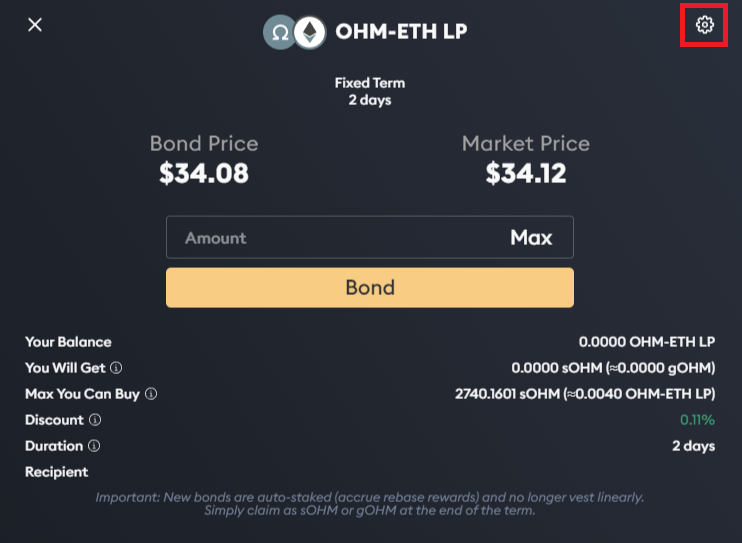

# Kaufe Einen Bond \(1, 1\)

Bonds ermöglichen es den Nutzern, OHM mit einem Abschlag vom Protokoll zu kaufen, indem sie sie gegen i\) Liquidität \(LP-Token\) oder ii\) andere Vermögenswerte eintauschen. Erstere werden als [Liquiditätsanleihen](../../references/glossary.md#liquidity-bonds) und letztere als [Reserveanleihen](../../references/glossary.md#reserve-bonds) bezeichnet. 

Es dauert etwa 15 Epochen, bis die Anleihen gültig werden, und die OHM-Token werden dem Nutzer in diesem Zeitraum linear zugeteilt. Liquiditätsanleihen helfen dem Protokoll, Liquidität zu akkumulieren und zu binden, während Reserveanleihen es dem Protokoll ermöglichen, seine Schatzkammer und damit seinen RFV schneller zu vergrößern. 

Olympus bietet fünf Arten von Anleihen auf seiner [Website](https://app.olympusdao.finance/#/bonds) an:

* [DAI bond](bond_dai.md)
* [FRAX bond](bond_frax.md)
* [wETH bond](bond_weth.md)
* [OHM-DAI LP bond](ohm-dai-lp-bond.md)
* [OHM-FRAX LP bond](bond_ohm_frax.md)

## Hades

Hades ist eine Funktion, die es Ihnen ermöglicht, Bonds zu kaufen und die erworbenen OHM an eine andere Adresse zu senden. Dies ist nützlich für zusätzliche Privatsphäre oder für den Kauf mehrerer Bonds, während die aktuellen Bonds noch gültig sind. Beachten Sie, dass bei mehreren Bonds auf demselben Konto die ausstehenden Belohnungen der früheren Bonds verfallen.

1. Gehen Sie zur [Bond Seite ](https://app.olympusdao.finance/#/bonds)und wählen Sie die Art des Bonds, die Sie kaufen möchten.
2. Wählen Sie den Betrag, den Sie bonden möchten, und klicken Sie dann auf das Zahnradsymbol oben rechts auf der Seite.

   

3. Das Hades-Menü wird eingeblendet. Im Feld Empfängeradresse können Sie eine andere Adresse angeben, an die das vested OHM gesendet werden soll. Standardmäßig ist das Feld mit Ihrer aktuellen Adresse gefüllt.

   

4. Sie können auch das Feld "Slippage" ändern, um die Wahrscheinlichkeit zu erhöhen oder zu verringern, dass Ihr Auftrag ausgeführt wird. Eine höhere Slippage erhöht diese Wahrscheinlichkeit, aber Sie erhalten möglicherweise einen unerwünschten Füllpreis.
5. Schließen Sie das Hades-Menü, indem Sie erneut auf das Zahnradsymbol klicken.
6. Klicken Sie auf "Approve und unterschreiben Sie die Transaktion.
7. Nachdem die Transaktion "Approve" erfolgreich bearbeitet wurde, klicken Sie auf "Bond" und unterschreiben die Transaktion. Voila, Sie haben Ihre erste Anleihe mit Hades gekauft!

_Hinweise:_

* _Die Transaktion "Approve" ist nur bei dem ersten Bond erforderlich; bei späteren Bonds müssen Sie nur noch die Transaktion "Bond" durchführen._
* _Wenn Sie den Hades verwenden, dürfen Sie den Betrag des Bonds nicht mehr ändern, nachdem Sie das Hades-Menü geschlossen haben, da sonst die Empfängeradresse zurückgesetzt wird._

## Einlösung

Gehen Sie auf die Seite "[Bonds](https://app.olympusdao.finance/#/bonds)" und wählen Sie die Art des Bonds aus, die Sie erworben haben. Wählen Sie die Registerkarte "Redeem". Klicken Sie dann auf "Claim Rewards", um alle Ihre verfügbaren Rewards zu beanspruchen.

## Lesen der Informationen

**Balance** ist Ihr Guthaben an SLP-Tokens. Dies ist der Vermögenswert, der zur Erstellung eines Bonds verwendet wird.

**Bond Price** ist der Preis des OHM, den Sie durch den bonding erhalten. Sie können den Bondpreis mit den folgenden Formeln berechnen:

* SLP Bond: \(Wert Ihres SLP-Tokens / OHM, den Sie durch das Bonding erhalten\)
* DAI Bond: \(Wert deines DAI-Tokens / OHM, den du durch das Bonding erhältst\)

**Market Price** ist der Marktpreis von OHM.

**You Will Get** sagt Ihnen, wie viele OHM Sie durch das Bonding erhalten werden.

**Debt Ratio** misst den Gesamtbetrag der OHM, der durch Bonds entstanden ist, die noch nicht durch das Protokoll ausgezahlt worden sind. Die Schuldenquote wird für SLP-Anleihen und DAI-Anleihen unterschiedlich berechnet:

* SLP Bond: \(OHM aus nicht eingelösten Bonds / OHM-Gesamtangebot\)
* DAI Bond: \(OHM aus nicht eingelösten Anleihen / OHM aus dem Umlaufvermögen\)

**Vesting Term** misst den Zeitraum, den ein Bond bis zur vollständigen Rückzahlung benötigt. Diese Zahl wird in Ethereum-Blöcken angegeben. 33110 Blöcke entsprechen etwa 5 Tagen oder 15 Epochen.

**Discount** ist die Differenz zwischen dem Bondpreis und dem Marktpreis. Im obigen Screenshot würden Sie mit einem Bond einen Rabatt von 10,63 % gegenüber dem Kauf der gleichen Menge OHM auf dem Markt erhalten.

**Pending Rewards** ist der OHM-Betrag, den Sie aus dem Bonding erhalten können.

**Claimable Rewards** ist der Betrag des OHM, den Sie jetzt beanspruchen können. Dieser Betrag erhöht sich kontinuierlich, da Ihnen im Laufe der Bindungsfrist OHM übertragen werden.

**Full Bond Maturation** bezieht sich auf den Ethereum-Block, wenn der Bond vollständig rückzahlbar ist.

