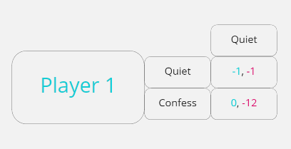
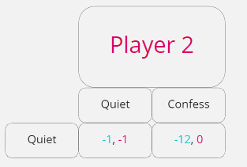
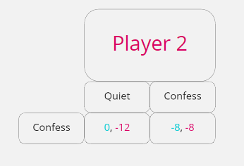
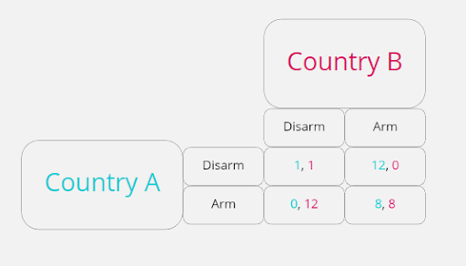
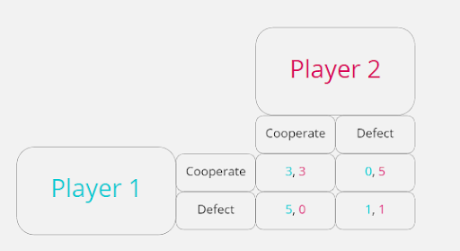

# La théorie des jeux

### Introduction&#x20;

Olympus est une innovation dans la manière dont les gens interagissent avec les protocoles financiers. La motivation de cet essai est de plonger dans le protocole Olympus, non pas d'un point de vue opérationnel ou financier, mais dans le but d'analyser les interactions humaines.&#x20;

De nombreux domaines ont quelque chose à dire sur l'interaction humaine, mais le domaine d'étude sur lequel nous nous concentrerons ici sera la théorie des jeux - l'étude de l'interdépendance stratégique.&#x20;

Nous pensons qu'Olympus résout le problème de la création d'une nouvelle monnaie par une coordination interne entre les différentes parties prenantes du protocole, sans recourir à une politique imposée par une entité centrale. Au fond, il s'agit d'un exemple de dilemme du prisonnier. Un dilemme du prisonnier est une situation dans laquelle l'intérêt personnel d'un individu est en conflit avec un objectif commun, ce qui conduit les joueurs du jeu à ne pas coopérer alors qu'il est dans leur intérêt de coopérer.&#x20;

Dans le cas des devises, il est dans l'intérêt de chacun d'utiliser les devises les plus liquides, les plus largement utilisées et les plus stables. Dans le domaine de la cryptographie, les actifs qui répondent le mieux à ces exigences sont les monnaies stables libellées en dollars. L'objectif commun est de supprimer la dépendance à la monnaie fiduciaire centralisée et de maintenir le pouvoir d'achat des individus.&#x20;

Ce sont des objectifs que les stablecoins n'atteignent catégoriquement pas et pourtant, ils font partie des actifs les plus utilisés en crypto. Aucun individu agissant seul ne peut démêler la crypto de la fiat ; il faut une coordination de masse, ainsi qu'un alignement des incitations, et c'est ce qu'Olympus facilite.&#x20;

Nous commencerons par présenter l'essentiel de la théorie des jeux et par analyser le dilemme du prisonnier d'un point de vue purement abstrait. Nous nous plongerons ensuite dans les composants spécifiques d'Olympe. Nous ne prendrons aucun raccourci. Olympus est un protocole complexe, le premier de son genre, qui mérite une analyse approfondie.&#x20;

Il s'agit d'un travail de collaboration qui sera révisé au fil du temps. Il s'adresse à un large éventail de lecteurs et si vous souhaitez faire part de vos commentaires ou contribuer aux futures sections, veuillez rejoindre le discord Olympus DAO et contacter l'équipe de la Communauté et du Contenu.

## Principes fondamentaux de la théorie des jeux

### Qu'est-ce que la théorie des jeux ?

La théorie des jeux est l'étude de l'interdépendance stratégique. Il existe de nombreuses situations dans la vie où la meilleure réponse à une situation dépend de ce que font les autres personnes dans cette même situation. Les situations stratégiques sont intéressantes car nous pouvons souvent obtenir des résultats multiples, dont certains sont remarquablement stables et pourtant sous-optimaux pour toutes les personnes impliquées.

Considérons une application macroéconomique aux multiples résultats stables dans ces conditions :

* Les entreprises n'investissent que si les clients achètent des biens.&#x20;
* Les clients n'achètent des biens que s'ils reçoivent un salaire.&#x20;
* Les entreprises ne versent un salaire aux clients que s'ils achètent des biens.

Le résultat optimiste (non exhaustif) :

* Les entreprises pensent que les clients achèteront des biens et augmentent donc la production.&#x20;
* Les clients achètent ces biens parce qu'ils pensent que leur salaire est sûr.&#x20;
* L'augmentation des bénéfices permet aux entreprises de payer des salaires plus élevés.

Le résultat pessimiste :&#x20;

* Les entreprises ne pensent pas que les clients achèteront des biens et limitent donc la production pour réduire les coûts.&#x20;
* Les clients limitent leurs achats parce qu'ils n'ont pas de sécurité salariale.&#x20;
* Les bénéfices des entreprises chutent, ce qui entraîne une réduction des coûts sous la forme de réductions de salaires et de licenciements.

Nous pouvons voir que personne ne veut se retrouver dans le résultat pessimiste et pourtant il est plausible. Pour comprendre pourquoi, nous utilisons la théorie des jeux.

### The Model

En substance, un modèle de théorie des jeux comporte les éléments suivants :

**Joueurs**\
Ils font des choix en fonction des informations qu'ils détiennent sur eux-mêmes, les autres joueurs et la structure du jeu.

**Strategie**\
L'ensemble des choix qu'un joueur fait dans un jeu.

**Paiement**\
Un gain est la récompense de chaque joueur, en fonction du résultat de leurs interactions. Nous décidons des gains en prenant en compte les préférences de chaque joueur dans le jeu.

**Matrice des gains**\
Un tableau qui répertorie toutes les stratégies disponibles et leurs gains respectifs.&#x20;

La théorie des jeux est utile car elle nous permet de déterminer la stratégie optimale qui produit le meilleur résultat pour tous les joueurs impliqués.&#x20;

La meilleure façon d'appréhender la puissance de la théorie des jeux est de prendre un exemple.

### Strat**é**gies

Pour voir quelle stratégie chaque joueur va choisir, nous devons examiner chaque coup isolément. Du point de vue du joueur 1, que doit-il faire s'il pense que le joueur 2 va rester tranquille ?

Nous pouvons voir que le joueur 1 devrait avouer parce que s'il reste silencieux, il aura un mois de prison et nous avons déjà dit que les deux joueurs préfèrent un temps de prison plus court.

Et si le joueur 1 pensait que le joueur 2 allait se confesser ?

Une fois encore, il semble que le joueur 1 doive se confesser, car cela lui vaudra 8 mois de prison au lieu des 12 qu'il recevra s'il se tait.&#x20;

En mettant tout cela ensemble, nous arrivons à une conclusion importante : Le joueur 1 a intérêt à avouer, quelle que soit la stratégie du joueur 2.&#x20;

Examinons le point de vue du joueur 2, en supposant qu'il pense que le joueur 1 va se taire :&#x20;

En regardant les seconds chiffres, nous pouvons voir que, comme le joueur 1, le joueur 2 devrait également avouer : il sera libéré au lieu d'être emprisonné pendant un mois.

Une fois de plus, il semble que la stratégie choisie soit de confesser, même si le joueur 2 pense que le joueur 1 va aussi confesser.

**Le joueur 2 a également intérêt à se confesser quelle que soit la stratégie du joueur 1.**

### Hypothèses et conclusions

* Nous avons supposé que les préférences des deux joueurs étaient de minimiser leur temps d'emprisonnement.&#x20;
* Nous supposons que les deux joueurs sont intéressés (c'est-à-dire qu'ils ne se soucient pas du sort de leurs amis).&#x20;
* Nous supposons qu'il n'y a qu'une seule interaction&#x20;
* Nous avons supposé que les joueurs ne pouvaient pas interagir et planifier leurs réponses à l'avance.

Ces hypothèses ont conduit à un résultat sous-optimal dans le jeu (Confesser, Confesser). Nous pouvons voir que si les deux joueurs étaient restés silencieux, ils auraient reçu moins de peine de prison. Il s'agit d'un équilibre instable car, comme nous l'avons vu, les deux joueurs sont motivés pour avouer s'ils pensent que l'autre restera silencieux.

(Confesser, Confesser) est donc le seul équilibre de Nash. Un équilibre de Nash est un état dans un jeu où aucun joueur ne souhaite s'écarter de sa stratégie, compte tenu de ce que font les autres joueurs.

**Cependant, si les deux joueurs avaient pu coopérer entre eux et rester tranquilles, ils auraient obtenu un meilleur résultat. Cette conclusion est importante car elle nous montre que deux individus peuvent ne pas coopérer, même si cela semble être la meilleure stratégie pour les deux.**

### Exemple concret

Nous pouvons appliquer le modèle du dilemme du prisonnier à de nombreuses situations du monde réel. Par exemple, imaginez que les joueurs soient remplacés par deux pays. Les stratégies disponibles pour les deux pays sont de s'armer (en remplaçant Confess) ou de désarmer (en remplaçant Quiet). Dans notre premier exemple, les gains représentent une peine de prison. Les gains ne doivent pas nécessairement représenter une chose "réelle", ils ne sont que les préférences et les hypothèses des joueurs exprimées par un nombre. Ce qui est important, c'est que les gains aient une signification les uns par rapport aux autres et qu'ils restent cohérents. Ainsi, dans notre première partie, les deux joueurs préféraient des scores plus bas. Si nous continuons à supposer que les deux joueurs (pays) de ce jeu veulent minimiser leur score, nous obtenons la matrice suivante :&#x20;

### Le dilemme du prisonnier itéré

Dans notre premier exemple du dilemme du prisonnier, nous avons supposé une seule interaction. Qu'est-ce qui change si nous jouons le jeu encore et encore ?

L'interaction unique analysée dans notre premier exemple n'est pas particulièrement réaliste. La vie est pleine d'interactions répétées et dans le cas d'Olympe, s'il veut atteindre son objectif de devenir une monnaie de réserve, il lui faudra de nombreuses interactions répétées.

Pour ce jeu, nous allons nous éloigner de l'histoire du dilemme des prisonniers et nous concentrer sur les gains. Le meilleur résultat pour l'un ou l'autre des joueurs est le nombre le plus élevé. Les stratégies ont également changé pour coopérer et faire défaut, car ce sont des termes plus larges qui reflètent mieux un large éventail de situations réelles.

### Matrice des gains

Si vous faites défection et que l'autre joueur coopère, vous obtiendrez le gain le plus élevé la première fois. Cependant, si vous continuez à faire défection, vous risquez de faire défection et de déplacer les joueurs vers la cellule inférieure droite - un résultat sous-optimal.

Rappelez-vous que les nombres spécifiques choisis n'ont pas d'importance mais que les différences relatives entre eux sont importantes. Nous supposons ici que la défection donne un gain plus élevé que la coopération. Nous supposons que cela répond aux critères du dilemme du prisonnier - où l'intérêt personnel d'un individu est en conflit avec un objectif commun. Un individu est motivé pour faire défection. Cependant, les meilleurs résultats possibles au cours de la série de jeux se produisent lorsque les deux joueurs coopèrent continuellement. Pour en avoir la preuve, et si vous souhaitez jouer vous-même avec les hypothèses, rendez-vous sur https://ncase.me/trust/.

Il s'agit d'un résultat crucial du projet mené par Robert Axelrod. Axelrod a organisé un tournoi où les participants soumettaient des programmes informatiques qui jouaient les uns contre les autres des parties répétées du dilemme du prisonnier. Les gains et les stratégies disponibles dans ce tournoi étaient identiques à ceux illustrés ci-dessus. Au total, 14 équipes se sont inscrites et chacune d'entre elles a programmé son programme avec un ensemble de règles permettant de choisir la stratégie de coopération ou de défection à chaque coup. Le tournoi était structuré comme un tournoi à la ronde, de sorte que chaque équipe jouait contre toutes les autres équipes, et chaque partie comportait 200 coups. Les participants étaient également jumelés avec leur propre jumeau et un programme RANDOM qui choisissait aléatoirement de coopérer ou de faire défaut avec une probabilité égale. Le tournoi a été répété 5 fois, ce qui a donné lieu à 120 000 coups et 240 000 choix distincts.

Les scores de ces parties ont été comptabilisés, donnant à chaque participant un score final. L'objectif était d'obtenir le meilleur score possible après toutes les parties. Le programme gagnant s'appelait TIT-FOR -TAT et sa stratégie était simple :

Au premier coup, coopérer. Ensuite, il faut jouer la stratégie que l'adversaire a utilisée au tour précédent.

Les joueurs se déplacent simultanément. Ainsi, si l'adversaire fait défaut au premier tour, TIT-FOR-TAT fera défaut au second. De cette façon, TIT-FOR-TAT ne peut pas être facilement exploité par d'autres programmes qui font défection à répétition. La défection est une réponse à la défection.

Il est également payant de coopérer avec TIT-FOR-TAT, car il coopérera toujours en retour. Bien que TIT-FOR-TAT ne puisse, par définition, jamais obtenir un score supérieur à celui de son adversaire dans une partie donnée (car il ne fait que correspondre aux stratégies et donc aux scores), il a quand même fait mieux que tous les autres participants sur l'ensemble des parties du tournoi.

### Implications de la coopération comme stratégie dominante

Le résultat du tournoi du dilemme du prisonnier itéré a des implications significatives à la fois pour la société en général et pour Olympus. On nous enseigne souvent que dans une économie capitaliste, les individus ne se préoccupent que de leur propre intérêt et que, par conséquent, un comportement égoïste et compétitif est la norme. Le tournoi d'Axelrod suggère que la coopération est en fait le meilleur moyen de gagner.&#x20;

Pour une analyse complète du tournoi et de ses implications, je recommande la lecture du livre d'Axelrod, "The Evolution of Cooperation". Dans la section suivante, je vais résumer les éléments clés qui, selon Axelrod, sont nécessaires au développement de la coopération dans les systèmes décentralisés.

### Promouvoir la Coopération

Comment établir un système de coopération entre des étrangers aux préférences très différentes, séparés par le temps et la géographie, qui ne se sont jamais rencontrés et qui ne le feront probablement jamais ?

Si vous prenez le temps de réfléchir à cette question, vous vous rendrez compte qu'il s'agit d'un problème auquel l'humanité est confrontée depuis des temps immémoriaux. S'il y a une chose pour laquelle l'humanité est douée, c'est bien la résolution des problèmes, et la résolution du problème de la coopération a alimenté la prospérité de l'humanité et facilité notre ingéniosité comme aucune autre créature dans l'univers. Alors comment avons-nous appris à coopérer ?
